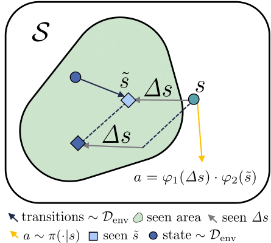
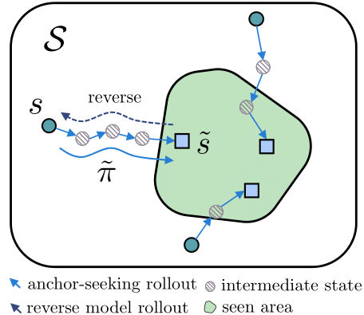
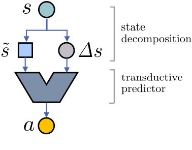

# COCOA: Compositional Conservatism with Anchor-Seeking

Official implementation of [COMPOSITIONAL CONSERVATISM: A TRANSDUCTIVE APPROACH IN OFFLINE REINFORCEMENT LEARNING](https://arxiv.org/abs/2404.04682)


<p align="center">
<p align="center">
  
  
  
</p>
</p>

## Overview
COCOA focuses on achieving the same objectives of conservatism but from a different perspective. It pursues conservatism in a compositional manner on top of the transductive reparameterization, which decomposes the input variable (the state in our case) into an anchor and its difference from the original input. COCOA seeks both in-distribution anchors and differences by utilizing the learned reverse dynamics model, encouraging conservatism in the compositional input space for the policy or value function. Such compositional conservatism is independent of and agnostic to the prevalent behavioral conservatism in offline RL. Here, we apply COCOA to four state-of-the-art offline RL algorithms and evaluate them on the D4RL benchmark, where COCOA generally improves the performance of each algorithm.


## Supported algorithms
- Model-free
    - [Conservative Q-Learning (CQL)](https://arxiv.org/abs/2006.04779)
    - [Implicit Q-Learning (IQL)](https://arxiv.org/abs/2110.06169)
- Model-based
    - [Model-based Offline Policy Optimization (MOPO)](https://arxiv.org/abs/2005.13239)
    - [Model-Bellman Inconsistency for Model-based Offline Reinforcement Learning (MOBILE)](https://proceedings.mlr.press/v202/sun23q.html)

## Benchmark Results (4 seeds)

| Task                     | BC    | CQL Alone | CQL +COCOA       | IQL Alone | IQL +COCOA        | MOPO Alone | MOPO +COCOA        | MOBILE Alone | MOBILE +COCOA        |
|--------------------------|-------|-----------|------------------|-----------|-------------------|------------|--------------------|--------------|----------------------|
| halfcheetah-random       | 2.2   | 31.3      | 23.8 ± 0.8       | -         | -                 | 37.3       | 33.9 ± 2.3         | 40.9         | 29.5 ± 2.4           |
| hopper-random            | 3.7   | 5.3       | **8.8 ± 1.6**    | -         | -                 | 31.7       | **32.3 ± 1.2**     | 17.4         | 11.5 ± 8.3           |
| walker2d-random          | 1.3   | 5.4       | **5.5 ± 8.5**    | -         | -                 | 4.1        | **23.7 ± 0.5**     | 9.9          | **21.4 ± 0.1**       |
| halfcheetah-medium       | 43.2  | 46.9      | **49.0 ± 0.2**   | 47.4      | 47.1 ± 0.1        | 72.4       | 70.8 ± 3.7         | 73.5         | 69.2 ± 1.0           |
| hopper-medium            | 54.1  | 61.9      | **66.0 ± 1.4**   | 66.3      | 65.5 ± 1.5        | 62.8       | 39.5 ± 2.3         | 92.9         | **103.7 ± 6.1**      |
| walker2d-medium          | 70.9  | 79.5      | **83.1 ± 0.3**   | 78.3      | **81.9 ± 0.2**    | 84.1       | **89.4 ± 1.4**     | 80.8         | **84.4 ± 1.3**       |
| halfcheetah-medium-replay| 37.6  | 45.3      | **46.4 ± 0.4**   | 44.2      | 40.3 ± 1.4        | 72.1       | 67.0 ± 0.5         | 66.8         | **68.6 ± 0.9**       |
| hopper-medium-replay     | 16.6  | 86.3      | **96.5 ± 1.9**   | 94.7      | 88.2 ± 5.9        | 92.8       | 71.4 ± 30.1        | 87.9         | **105.3 ± 1.7**      |
| walker2d-medium-replay   | 20.3  | 76.8      | **83.9 ± 2.9**   | 73.9      | 66.9 ± 10.0       | 85.2       | **93.1 ± 5.1**     | 81.1         | **83.5 ± 1.7**       |
| halfcheetah-medium-expert| 44.0  | 95.0      | 92.4 ± 3.1       | 86.7      | **91.4 ± 1.4**    | 83.6       | **109.1 ± 1.4**    | 86.75        | 104.1 ± 2.0          |
| hopper-medium-expert     | 53.9  | 96.9      | 103.3 ± 1.4      | 91.5      | 105.3 ± 2.0       | 74.9       | 101.4 ± 13.9       | 102.3        | 109.1 ± 4.7          |
| walker2d-medium-expert   | 90.1  | 109.1     | 109.4 ± 0.4      | 109.6     | 109.1 ± 0.9       | 105.3      | 109.1 ± 0.4        | 107.0        | 107.5 ± 0.9          |
| Average                  | 36.5  | 61.6      | 64.0             | 77.0      | 77.3              | 67.2       | 70.1               | 70.6         | 74.8                 |

## Installation

```shell
git clone https://github.com/runamu/compositional-conservatism.git
conda env create --file cocoa.yaml
```

## Quick Start
### 1. Train anchor seeker
####  `run_anchor_seeker.py`
```shell
OMP_NUM_THREADS=1 OPENBLAS_NUM_THREADS=1 MKL_NUM_THREADS=1 VECLIB_MAXIMUM_THREADS=1 NUMEXPR_NUM_THREADS=1 D4RL_SUPPRESS_IMPORT_ERROR=1 python run_example/run_anchor_seeker.py --task halfcheetah-medium-expert-v2 --reverse_policy_mode divergent --load_dynamics_path dummy --rollout_epoch 100 --rollout_length 5 --scale_coef 0.8 --noise_coef 0.1 --seed 0
```
- **Purpose:**
    1. Train the reverse dynamics model.
    2. Generate the anchor-seeking trajectories.
    3. Train the anchor seeking policy.
- **Important Notes:**
  - Upon executing the command, the anchor-seeking trajectories will be saved in a `reverse_imagination.pkl` file will be saved in the `result` directory under the log directory.
  - Also, `anchor_seeker_pretrain.pth` file will be saved in the `model` directory under the log directory.
  - The implementation is set up end-to-end. As a result, once the reverse dynamics are trained, the anchor-seeking trajectories are immediately generated and the anchor seeking policy is then trained using them.

------
### 2. Train policy
####  e.g. `run_mopo.py`
For dynamics training, the following command can be executed:
```shell
OMP_NUM_THREADS=1 OPENBLAS_NUM_THREADS=1 MKL_NUM_THREADS=1 VECLIB_MAXIMUM_THREADS=1 NUMEXPR_NUM_THREADS=1 D4RL_SUPPRESS_IMPORT_ERROR=1
python run_example/run_mopo.py --task halfcheetah-medium-expert-v2
```
Then, the main policy training can be executed as follows:
```shell
OMP_NUM_THREADS=1 OPENBLAS_NUM_THREADS=1 MKL_NUM_THREADS=1 VECLIB_MAXIMUM_THREADS=1 NUMEXPR_NUM_THREADS=1 D4RL_SUPPRESS_IMPORT_ERROR=1
python run_example/run_mopo.py --task halfcheetah-medium-expert-v2 --load_dynamics_path ./your/dynamics_directory/model --load_anchor_seeker_path ./your/anchor_seeker_directory/model --actor_horizon_len 1 --critic_horizon_len 1 --penalty_coef 2.5 --rollout_length 5 --seed 0
```
- **Purpose:**
    1. Train the dynamics model.
    2. Train and test the policy using the COCOA framework.
- **Important Notes:**
  - If you have pre-trained models for dynamics or anchor seeking and wish to use them, you can specify their paths using `load_dynamics_path` and `load_anchor_seeker_path` arguments. This allows you to quickly conduct experiments.


## Citing COCOA
If you use COCOA in your work, please use the following bibtex
```tex
@inproceedings{
    song2024compositional,
    title={Compositional Conservatism: A Transductive Approach in Offline Reinforcement Learning},
    author={Yeda Song and Dongwook Lee and Gunhee Kim},
    booktitle={The Twelfth International Conference on Learning Representations},
    year={2024},
    url={https://openreview.net/forum?id=HRkyLbBRHI}
}
```
